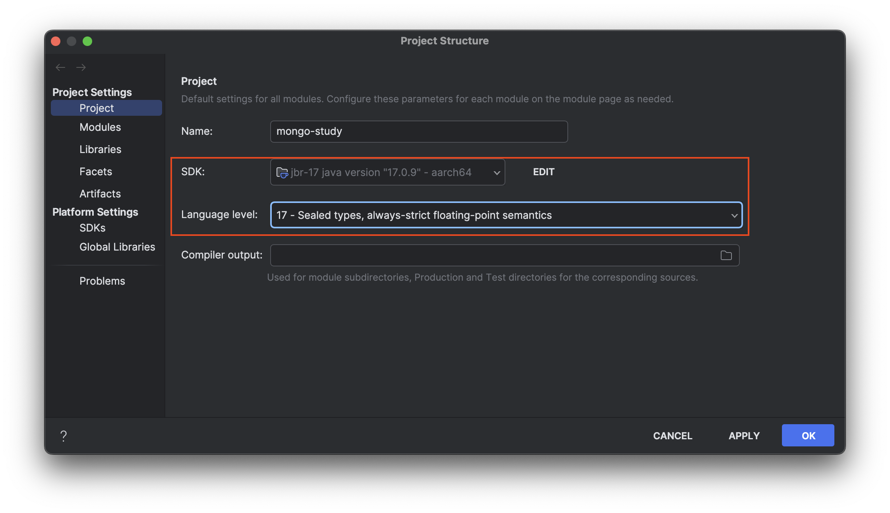
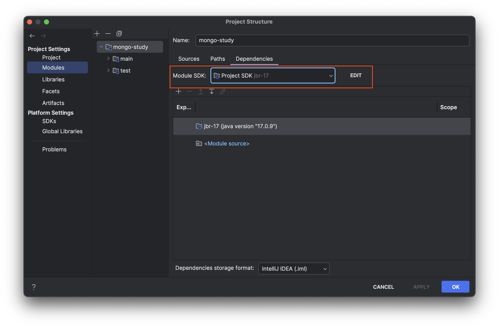
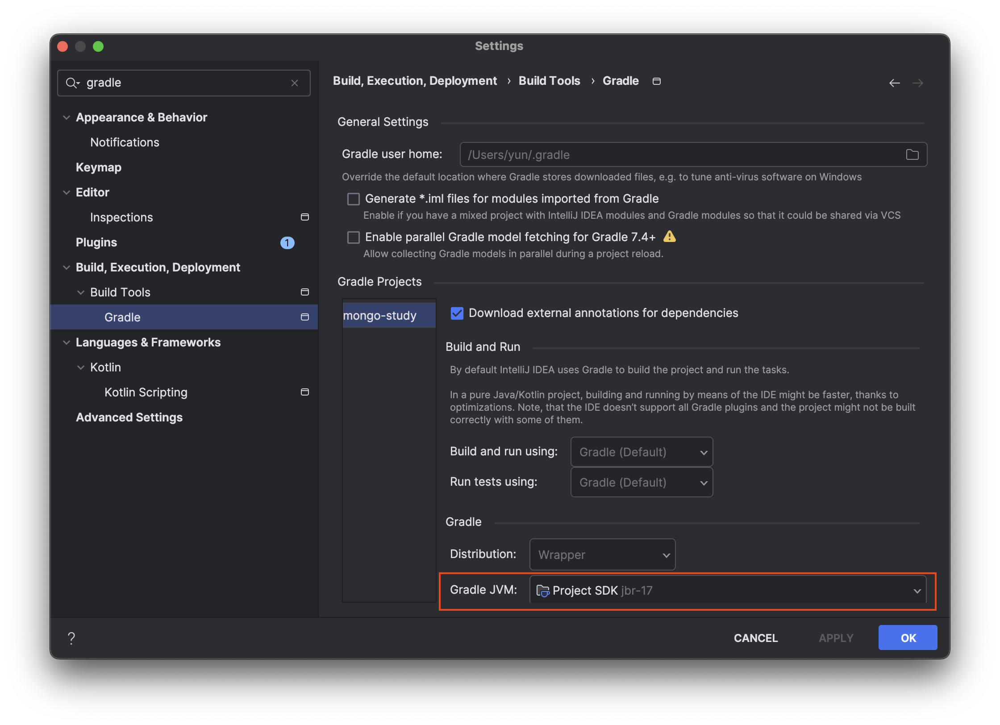
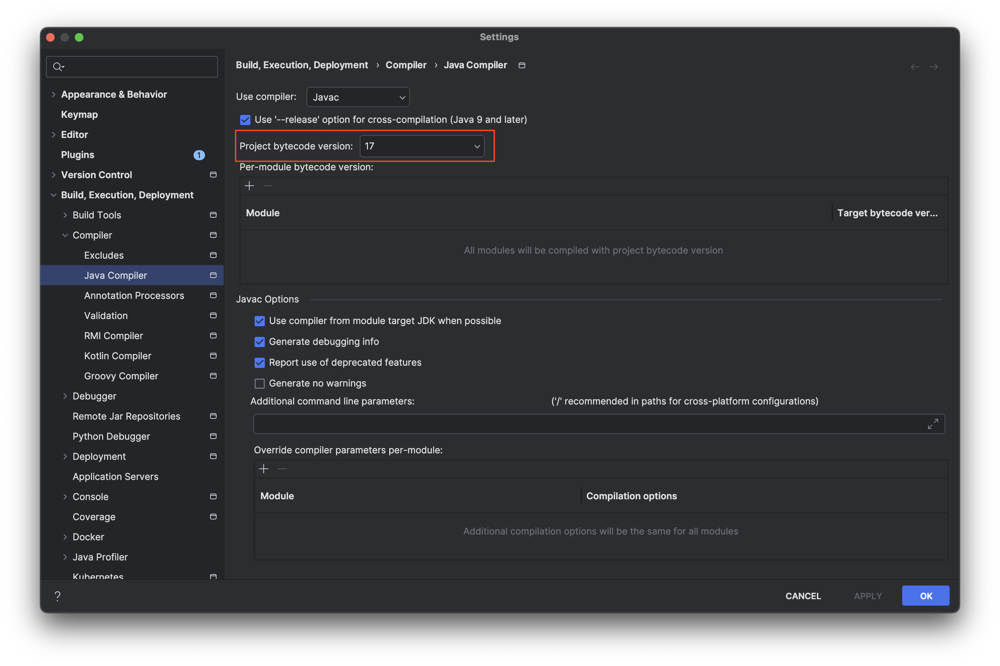

# IntelliJ cannot resolve symbol 에러 해결

자바에서 Lombok과 같은 라이브러리로 인한 `cannot resolve symbol` 오류는 대체로 SDK 버전 문제로 발생합니다. 이를 해결하기 위해서는 프로젝트 내의 SDK 버전을 일관되게 설정해야 합니다. 이 과정에서 여러 설정을 조정해야 하는데, 구체적인 SDK 설정 방법에 대해 안내해 드리겠습니다.

## Project Settings 설정

### Project 설정

Project Structure 설정에서 SDK, Language Level을 동일한 버전으로 설정합니다.

### Modules 설정

Module SDK 버전도 동일한 버전으로 설정합니다.

## Gradle 설정

Gradle JVM SDK 버전도 동일하게 설정합니다.

## Java Compiler 설정

Java Compiler 설정도 동일한 버전으로 설정합니다.

