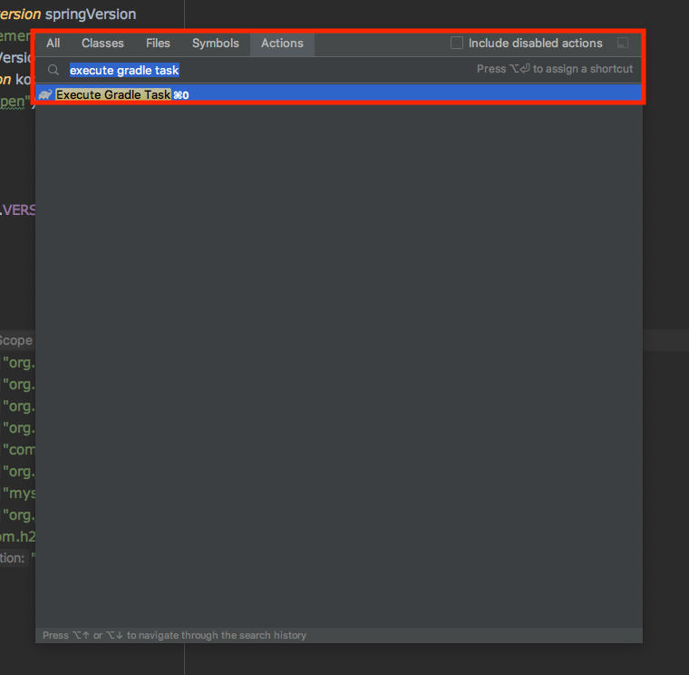
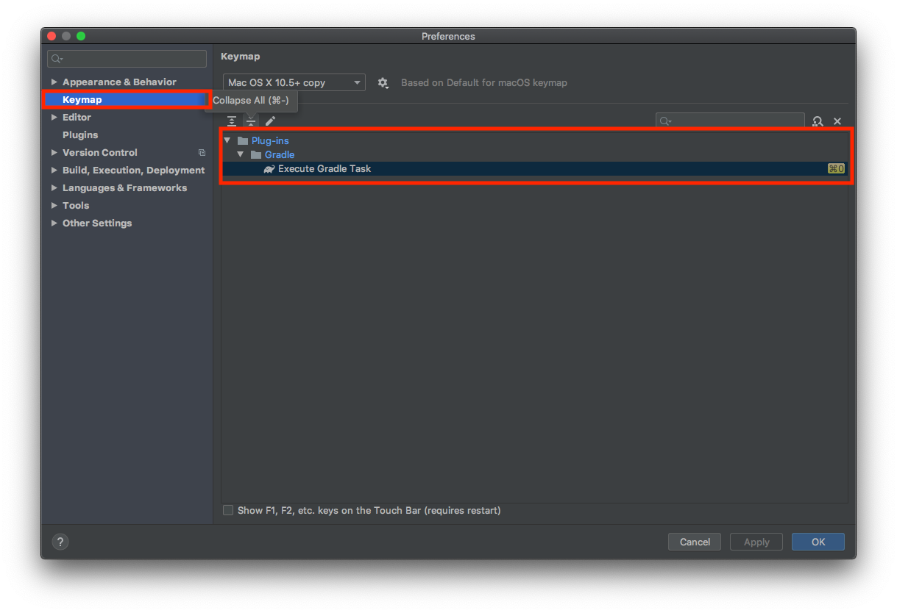
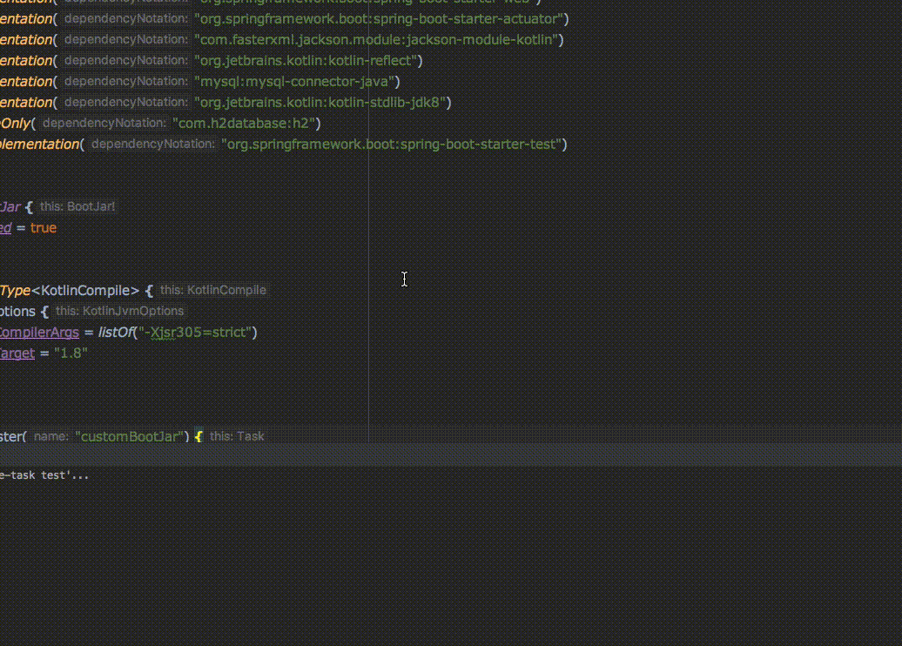
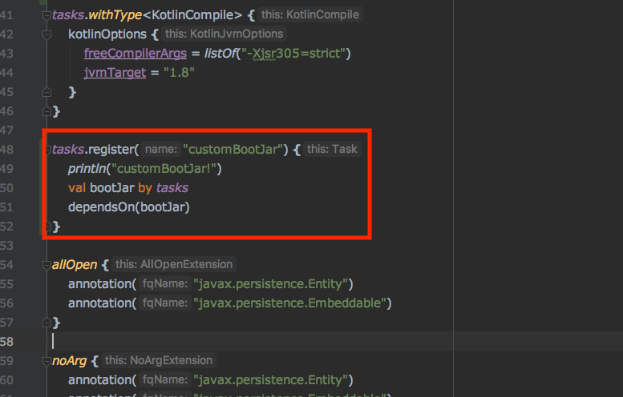
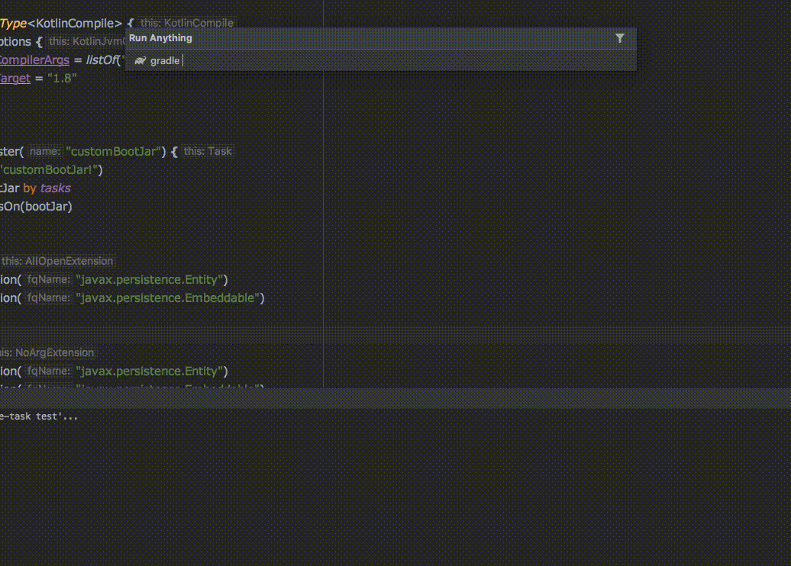

IntellIj를 이용하면 Gradle Task의 명령어 자동완성 기능을 Gradle을 보다 쉽게 사용할 수 있습니다.

## 설정 방법

Find Action에서 `Execute Gradle Task`을 열어 볼 수 있습니다.

단축키를 지정해서 사용하는 것을 권장드립니다. `Keymap` -> `Execute Gradle Task` -> `Hot Key` 지정
저같은 경우에는 `CMD + 0`으로 지정해서 사용하고 있습니다.

## 사용법

`Execute Gradle Task`를 실행하면 위 화면 처럼 해당 Gradle 명령어를 assistant 해줍니다.

위 그림처럼 커스텀하게 등록한 task도 assistant 해줍니다.

