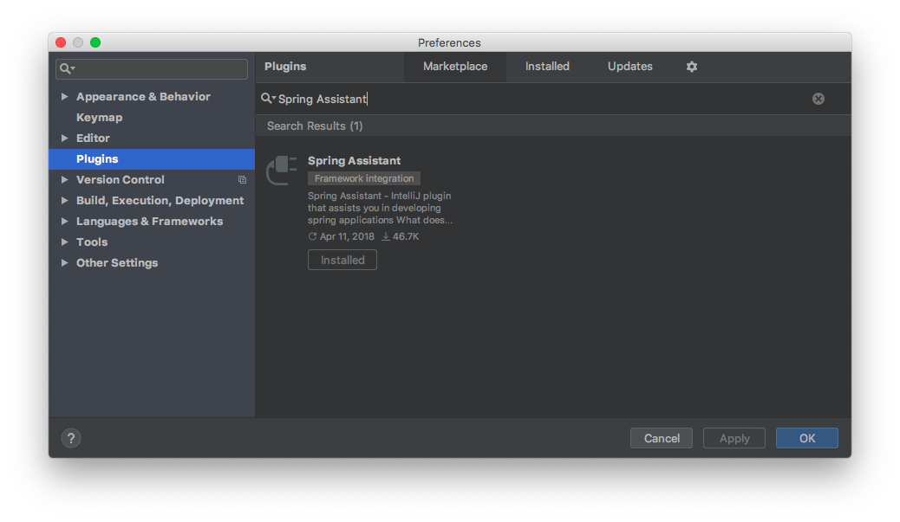

# Spring Assistant

> [이미지 출저 : JetBrains Spring Assistant](https://plugins.jetbrains.com/plugin/10229-spring-assistant)

위 그림 처럼 `properties` 파일을 자동으로 완성해주는 플러그인이다. 대부분 기본으로 설치가 되어있다.

## 설치

`Preferences` -> `Plugins` -> `Sprong Assistant` 검색 -> install