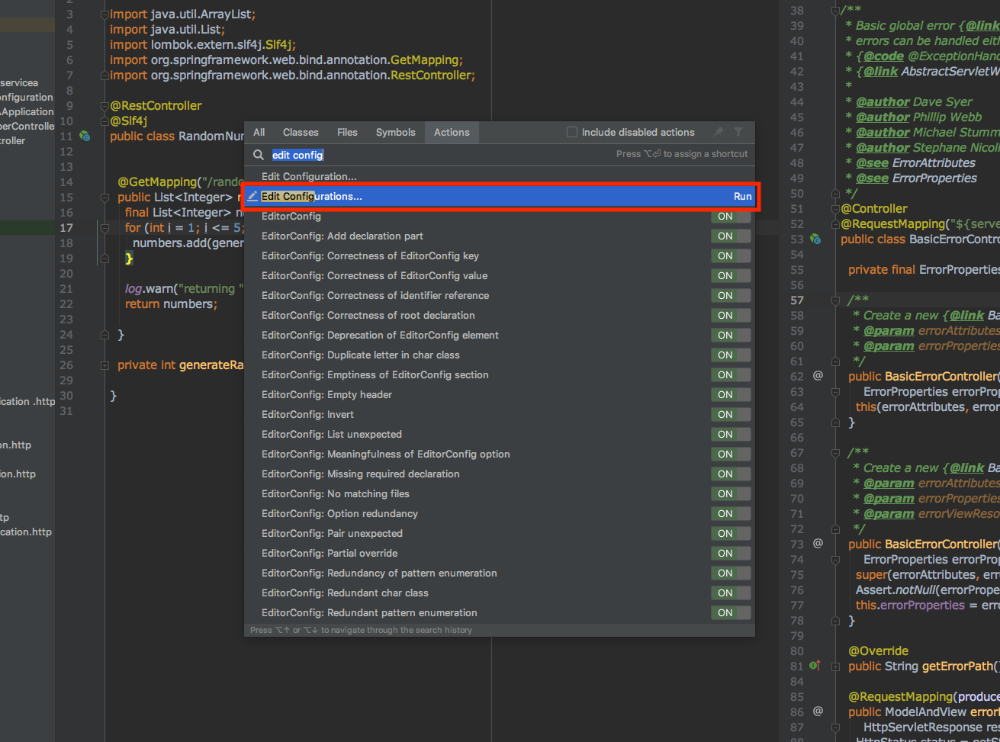
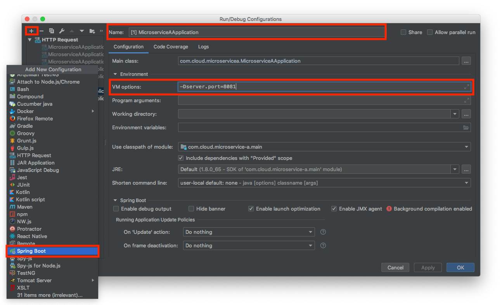
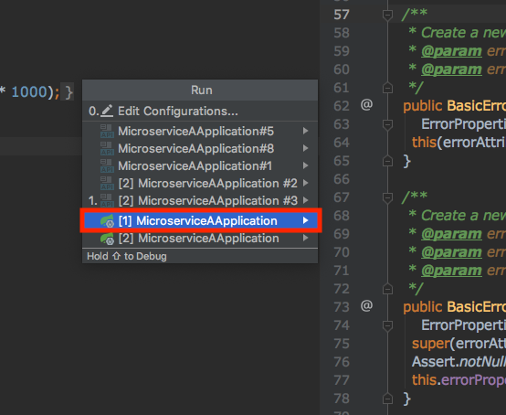
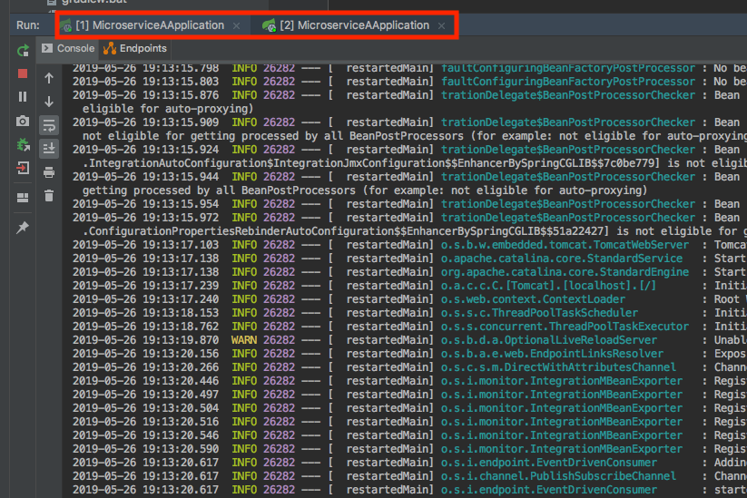

# 스프링 부트 여러대 서버 구동 시키기

1. 단축키 cmd + F11로 `edit configuration` 검색합니다.
2. 해당 `edit configuration` 으로 들어갑니다.

1. 왼쪽 상단의 `+` 버튼을 클릭합니다.
2. `Spring Boot`을 선택합니다.
3. 상단의 `Name` 이름을 지정합니다.
4. `VM options`에 `-Dserver.port=8081`을 지정합니다.
5. 동일한 방법으로 다른 Port도 등록합니다.

1. ctrl + alt + r 단축키로 Run을 실행합니다.
2. 위에서 등록한 2개의 Application을 선택합니다.

위에서 등록한 Application 2개가 실행되는것을 확인할 수 있습니다.

