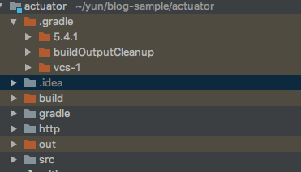
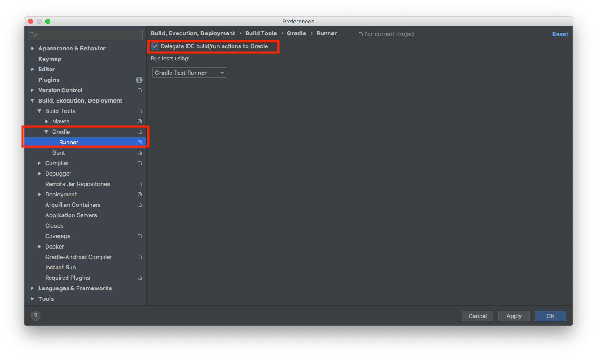
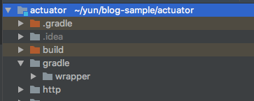

## Sprong Boot Run Gradle에게 위임하기

인텔리제이에서 Gradle Spring Boot Run을 실행시킬 경우 out 디렉토리가 생성됩니다. Gradle 플러그들이나 Task 작업에 추가적인 것들이 `out` 디렉토리에 반영이 되지 않습니다.

인텔리제이에서는 Sprong Boot Run 작업을 Gradle에게 위임하는 옵션이 있습니다. 이 옵션으로 인텔리제이에서 Gradle을 사용하여 Run을 동작시킬수 있습니다.

preference -> Gradle -> Runner -> Delegate IDE ... CheckBox를 선택

이제 인텔리제이를 실행하더라도 `out` 디렉토리가 생성되지 않은것을 확인할 수 있습니다.